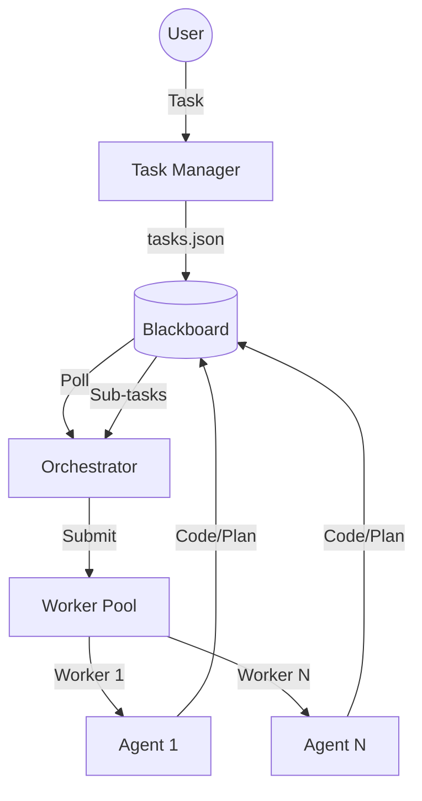

# HIVE Architecture

HIVE is an autonomous agent swarm orchestrator designed for high-concurrency software engineering tasks. It follows the **Blackboard Design Pattern**, where a central registry (the blackboard) coordinates multiple specialized workers.

## Core Components

### 1. The Orchestrator (The Brain)
The Orchestrator is the central controller. Its responsibilities include:
- **Task Dispatching**: Polling the Task Registry (`tasks.json`) and submitting pending tasks to the Worker Pool.
- **Git Integration**: Managing feature branches, commits, and pull requests for completed tasks.
- **Auto-Planning**: Processing agent-generated plans to spawn sub-tasks automatically.

### 2. The Worker Pool (The Muscles)
A multithreaded pool of workers. Each worker:
- Manages an isolated **Agent Driver**.
- Handles a single task's lifecycle (Context Loading -> Implementation -> Review).
- Reports results back to the Orchestrator via asynchronous channels.

### 3. Agent Driver (The Interface)
A flexible abstraction layer that drives AI agents in episodic mode:
- **Episodic Mode**: Executing one-shot commands (e.g., `opencode run [message]`).

## Data Flow: The Blackboard Pattern

## Task Lifecycle

1. **Pending**: Task added to `tasks.json`.
2. **In-Progress**: Worker claims task, initializes agent environment.
3. **Implementation**: Agent writes code/docs to the shared filesystem.
4. **Review**: Agent verifies its own work against success criteria.
5. **Completed**: Orchestrator commits changes and marks task as done.

## The Hacker Grid TUI
The "Hacker Grid" provides real-time visualization of the entire swarm. It uses `bubbletea` and `lipgloss` to render a 3x2 tiled dashboard monitoring the Orchestrator and all active Workers simultaneously.
